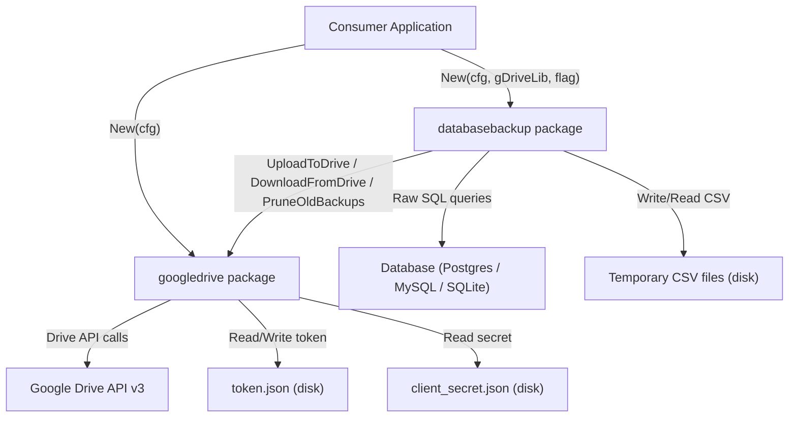

# Design Document: go-libs

## Overview

`go-libs` is a public Go module at `github.com/sabandar-lib/go-libs` providing two independent, reusable packages:

- **`googledrive`** — OAuth2-authenticated Google Drive client for uploading, downloading, and pruning backup folders.
- **`databasebackup`** — Database backup and restore orchestrator that exports tables to CSV, uploads them to Google Drive, and restores them on demand.

The library is designed for use by long-running services that need automated, scheduled database backups. All external collaborators (OAuth2 config, GORM DB, Google Drive client) are injected via constructors or function parameters, keeping the library fully decoupled from any consuming project.

### Key Design Decisions

1. **Interface-first design**: Both packages expose narrow interfaces (`GoogleDriveInterface`, `DatabaseBackupInterface`), making them easy to mock in consumer tests.
2. **No internal DB connections**: The `databasebackup` package never opens a database connection; callers always provide a `*gorm.DB`.
3. **Persistent token source**: The OAuth2 token is loaded from and written back to disk on every refresh, enabling long-running services to survive token expiry without manual intervention.
4. **CSV as the interchange format**: CSV is portable, human-readable, and easy to inspect. The `encoding/csv` standard library handles quoting and escaping.
5. **Dialect detection via GORM's `Dialector.Name()`**: The `databasebackup` package calls `db.Dialector.Name()` to determine the SQL dialect and select the appropriate table-listing query.

---

## Architecture



### Package Boundaries

| Package | Responsibility | External Dependencies |
|---|---|---|
| `googledrive` | OAuth2 auth, Drive folder/file CRUD | `golang.org/x/oauth2`, `google.golang.org/api/drive/v3` |
| `databasebackup` | Table export/import, orchestration | `gorm.io/gorm`, `googledrive` (via interface) |

The two packages share no code. `databasebackup` depends on `googledrive` only through the `GoogleDriveInterface` interface, which it receives via constructor injection.

---

## Components and Interfaces

### googledrive Package

#### `GoogleDriveConfig`

```go
// GoogleDriveConfig holds all configuration for the Google Drive client.
type GoogleDriveConfig struct {
    GDriveClientSecretFileDir string  // path to OAuth2 client_secret.json
    GDriveFolderID            string  // ID of the parent Drive folder
    GDriveTokenFileDir        string  // path to token.json (read/write)
    GDriveBackupCycle         string  // "daily" | "weekly" | "monthly"
    GDriveRetainMonths        float64 // months of backups to retain
}
```

#### `GoogleDriveInterface`

```go
type GoogleDriveInterface interface {
    UploadToDrive(ctx context.Context, timeStampDir string, files []string) error
    DownloadFromDrive(ctx context.Context, outDir string, pageSize int64) (string, error)
    PruneOldBackups(ctx context.Context) error
}
```

#### `googleDriveClient` (unexported struct)

Implements `GoogleDriveInterface`. Holds a `*drive.Service` (constructed once in `New`) and the config.

```go
type googleDriveClient struct {
    cfg     GoogleDriveConfig
    service *drive.Service
}
```

#### `New(cfg GoogleDriveConfig) GoogleDriveInterface`

Constructs the Drive service using `persistentTokenSource`. Returns a `*googleDriveClient` as `GoogleDriveInterface`.

#### `Login(cfg GoogleDriveConfig) error`

Standalone function (not a method). Runs the OAuth2 browser flow (`oauth2.Config.AuthCodeURL` + `Exchange`) and writes the resulting token to `cfg.GDriveTokenFileDir`.

#### `persistentTokenSource`

```go
type persistentTokenSource struct {
    mu        sync.Mutex
    tokenFile string
    source    oauth2.TokenSource // wraps oauth2.ReuseTokenSource
}

func (p *persistentTokenSource) Token() (*oauth2.Token, error)
```

Implements `oauth2.TokenSource`. On each `Token()` call it delegates to the inner `oauth2.ReuseTokenSource`. If the inner source returns a refreshed token (detected by comparing expiry), it serialises the new token to `tokenFile` under a mutex.

**Initialisation flow:**
1. Read `tokenFile` → unmarshal `oauth2.Token`.
2. Read `clientSecretFile` → parse `oauth2.Config` via `google.ConfigFromJSON`.
3. Create `oauth2.ReuseTokenSource(token, cfg.TokenSource(ctx, token))`.
4. Wrap in `persistentTokenSource`.

#### Internal helpers (`files.go`)

| Function | Signature | Purpose |
|---|---|---|
| `createFolder` | `(svc *drive.Service, name, parentID string) (string, error)` | Creates a Drive folder inside `parentID` |
| `uploadFile` | `(svc *drive.Service, localPath, parentID string) error` | Uploads a single file |
| `listFiles` | `(svc *drive.Service, parentID string, pageSize int64, orderBy string) ([]*drive.File, error)` | Lists files/folders with ordering |
| `downloadFile` | `(svc *drive.Service, fileID, destPath string) error` | Downloads a single file by ID |

---

### databasebackup Package

#### `DatabaseBackupConfig`

```go
type DatabaseBackupConfig struct {
    DBBackupOutDirPrefix string // prefix for os.MkdirTemp
}
```

#### `DatabaseBackupInterface`

```go
type DatabaseBackupInterface interface {
    BackupAll(ctx context.Context, db *gorm.DB, tableOrderMap map[string]string) error
    RestoreAllBackups(ctx context.Context, db *gorm.DB, tableOrderMap map[string]string) error
    PruneOldBackups(ctx context.Context) error
}
```

#### `databaseBackupClient` (unexported struct)

```go
type databaseBackupClient struct {
    cfg                DatabaseBackupConfig
    gDriveLib          GoogleDriveInterface
    restoreFeatureFlag bool
}
```

#### `New(cfg DatabaseBackupConfig, gDriveLib GoogleDriveInterface, restoreFeatureFlag bool) DatabaseBackupInterface`

Returns a `*databaseBackupClient` as `DatabaseBackupInterface`.

#### Internal helpers

**`export.go`**

| Function | Signature | Purpose |
|---|---|---|
| `getTables` | `(db *gorm.DB) ([]string, error)` | Detects dialect and queries table list |
| `exportAllTables` | `(db *gorm.DB, tableOrderMap map[string]string, outDir string) error` | Iterates tableOrderMap, calls exportTable |
| `exportTable` | `(db *gorm.DB, tableName, prefix, outDir string) error` | Queries all rows, writes CSV |

**`restore.go`**

| Function | Signature | Purpose |
|---|---|---|
| `downloadAllBackup` | `(ctx context.Context, gDriveLib GoogleDriveInterface, outDir string, pageSize int64) (string, error)` | Calls DownloadFromDrive |
| `restoreTable` | `(db *gorm.DB, csvPath string) error` | Reads CSV, calls insertBatch |
| `insertBatch` | `(db *gorm.DB, tableName string, columns []string, rows [][]string) error` | Builds and executes batched INSERT … ON CONFLICT DO NOTHING |

---

## Data Models

### OAuth2 Token (on disk)

Stored as JSON at `GDriveTokenFileDir`. Standard `oauth2.Token` struct serialised with `encoding/json`:

```json
{
  "access_token": "...",
  "token_type": "Bearer",
  "refresh_token": "...",
  "expiry": "2025-01-01T00:00:00Z"
}
```

### CSV Backup File

Each table is exported to a file named `{prefix}_{tableName}.csv` (e.g., `001_users.csv`).

**Format:**
- Row 0: column headers (column names from the query result)
- Rows 1…N: data rows

**Type serialisation rules:**

| Go type | CSV representation |
|---|---|
| `nil` | `"NULL"` |
| `time.Time` | RFC3339Nano in UTC (e.g., `2024-01-15T10:30:00.000000000Z`) |
| `[]byte` | UTF-8 string (handles JSONB, text stored as bytes) |
| `bool` | `"true"` or `"false"` |
| All others | `fmt.Sprintf("%v", value)` |

### Keep Count Formula

| `GDriveBackupCycle` | Keep count |
|---|---|
| `"daily"` | `int(30 * GDriveRetainMonths)` |
| `"weekly"` | `int(4 * GDriveRetainMonths)` |
| `"monthly"` | `int(1 * GDriveRetainMonths)` |
| anything else | error |

### Dialect Detection

```go
switch db.Dialector.Name() {
case "postgres":
    // SELECT table_name FROM information_schema.tables
    // WHERE table_schema = 'public' AND table_type = 'BASE TABLE'
case "mysql":
    // SELECT table_name FROM information_schema.tables
    // WHERE table_schema = DATABASE()
case "sqlite":
    // SELECT name FROM sqlite_master WHERE type='table'
default:
    return nil, fmt.Errorf("unsupported dialect: %s", db.Dialector.Name())
}
```

### Batch Insert SQL

For each batch of up to 100 rows:

```sql
INSERT INTO "tableName" ("col1", "col2", ...) VALUES
  ($1, $2, ...),
  ($3, $4, ...)
ON CONFLICT DO NOTHING
```

The SQL is built using `db.Exec` with positional parameters to prevent SQL injection. Column names are quoted with `"` (double-quote, ANSI SQL standard, compatible with Postgres, MySQL in ANSI mode, and SQLite).

---

## Correctness Properties

*A property is a characteristic or behavior that should hold true across all valid executions of a system — essentially, a formal statement about what the system should do. Properties serve as the bridge between human-readable specifications and machine-verifiable correctness guarantees.*

Property-based testing is applicable to this library because it contains pure transformation logic (CSV serialisation, keep-count computation, batch sizing, restore ordering) that has well-defined universal properties across a wide input space.

The recommended PBT library for Go is [`pgregory.net/rapid`](https://pkg.go.dev/pgregory.net/rapid), which provides generators for arbitrary Go values and integrates with `testing.T`.

---

### Property 1: Token load round-trip

*For any* valid `oauth2.Token` serialised to a JSON file, initialising a `persistentTokenSource` from that file and calling `Token()` SHALL return a token with the same `AccessToken`, `RefreshToken`, and `Expiry` fields.

**Validates: Requirements 3.1**

---

### Property 2: Token persistence after refresh

*For any* valid `oauth2.Token`, when the `persistentTokenSource` produces a refreshed token (new `AccessToken`, updated `Expiry`), the token file at `GDriveTokenFileDir` SHALL contain the refreshed token values.

**Validates: Requirements 3.2**

---

### Property 3: All files are uploaded to the subfolder

*For any* non-empty list of local file paths, calling `UploadToDrive` with a mock Drive service SHALL result in exactly one `uploadFile` call per file, all targeting the subfolder created by `createFolder`.

**Validates: Requirements 5.2**

---

### Property 4: Upload failure identifies the failed file

*For any* list of file paths where one randomly chosen file fails to upload, `UploadToDrive` SHALL return an error whose message contains the name of the failed file.

**Validates: Requirements 5.4**

---

### Property 5: Most-recent folder is selected for download

*For any* non-empty list of Drive folders with distinct `createdTime` values, `DownloadFromDrive` SHALL select the folder with the latest `createdTime` and return its name.

**Validates: Requirements 6.2, 6.4**

---

### Property 6: All CSV files are downloaded from the selected folder

*For any* Drive folder containing N CSV files, `DownloadFromDrive` SHALL download exactly N files into `outDir`.

**Validates: Requirements 6.3**

---

### Property 7: Keep count formula is correct

*For any* `GDriveRetainMonths` value greater than zero and any valid `GDriveBackupCycle` (`"daily"`, `"weekly"`, `"monthly"`), the computed keep count SHALL equal `int(multiplier * GDriveRetainMonths)` where the multiplier is 30, 4, or 1 respectively.

**Validates: Requirements 7.2**

---

### Property 8: Invalid backup cycle returns an error

*For any* string that is not one of `"daily"`, `"weekly"`, or `"monthly"`, calling `PruneOldBackups` SHALL return a non-nil error.

**Validates: Requirements 7.4**

---

### Property 9: Correct folders are retained and deleted

*For any* list of N Drive folders (N ≥ 0) and any keep count K (0 ≤ K ≤ N), `PruneOldBackups` SHALL retain exactly min(K, N) folders (the most recent ones) and delete exactly max(0, N−K) folders.

**Validates: Requirements 7.3**

---

### Property 10: Unsupported dialect returns an error

*For any* GORM `Dialector` whose `Name()` returns a string not in `{"postgres", "mysql", "sqlite"}`, calling `BackupAll` SHALL return a non-nil error.

**Validates: Requirements 11.4**

---

### Property 11: CSV export file naming

*For any* `tableOrderMap` with N entries, `BackupAll` SHALL create exactly N CSV files, each named `{prefix}_{tableName}.csv` where `prefix` is the value from the map for that table.

**Validates: Requirements 9.2**

---

### Property 12: time.Time serialisation is RFC3339Nano UTC

*For any* `time.Time` value (including values with sub-second precision and non-UTC locations), the CSV serialiser SHALL format it as RFC3339Nano in UTC, and parsing that string back with `time.Parse(time.RFC3339Nano, s)` SHALL yield a time equal to the original when compared in UTC.

**Validates: Requirements 10.2**

---

### Property 13: []byte serialisation round-trip

*For any* `[]byte` value that is valid UTF-8, the CSV serialiser SHALL produce a string such that converting that string back to `[]byte` yields the original value.

**Validates: Requirements 10.3**

---

### Property 14: CSV export/import round-trip

*For any* database row containing values of all supported types (nil, time.Time, []byte, bool, and string-representable scalars), exporting to CSV and then parsing the CSV back SHALL produce a row whose values are equivalent to the originals under the defined serialisation rules.

**Validates: Requirements 10.5**

---

### Property 15: Restore order is ascending by numeric prefix

*For any* set of CSV backup files with distinct numeric string prefixes, `RestoreAllBackups` SHALL process the files in ascending lexicographic order of their numeric prefix, ensuring lower-numbered tables are restored before higher-numbered ones.

**Validates: Requirements 12.3**

---

### Property 16: Batch insert uses ON CONFLICT DO NOTHING

*For any* CSV file with R rows, the generated SQL statements SHALL each use `INSERT INTO … ON CONFLICT DO NOTHING`, and the number of INSERT statements SHALL equal `ceil(R / 100)`.

**Validates: Requirements 13.1, 13.2**

---

### Property 17: Restore idempotence

*For any* valid CSV backup file, restoring it twice into the same database SHALL produce the same database state as restoring it once.

**Validates: Requirements 13.4**

---

## Error Handling

### googledrive Package

| Scenario | Error strategy |
|---|---|
| Token file missing | Return `fmt.Errorf("token file not found: %w", err)` from `persistentTokenSource` init |
| Token file malformed | Return `fmt.Errorf("failed to parse token file: %w", err)` |
| Client secret file missing/malformed | Return `fmt.Errorf("failed to read client secret: %w", err)` |
| Drive folder creation failure | Return `fmt.Errorf("failed to create folder %q: %w", name, err)` |
| File upload failure | Return `fmt.Errorf("failed to upload file %q: %w", localPath, err)` |
| No folders found in Drive | Return `"", fmt.Errorf("no backup folders found in Drive folder %q", folderID)` |
| File download failure | Return `"", fmt.Errorf("failed to download file %q: %w", fileID, err)` |
| Invalid backup cycle | Return `fmt.Errorf("invalid backup cycle %q: must be daily, weekly, or monthly", cycle)` |
| Folder deletion failure | Return `fmt.Errorf("failed to delete folder %q: %w", folderID, err)` |
| OAuth2 flow failure | Return `fmt.Errorf("oauth2 exchange failed: %w", err)` |

### databasebackup Package

| Scenario | Error strategy |
|---|---|
| Temp dir creation failure | Return `fmt.Errorf("failed to create temp dir: %w", err)` |
| Table listing failure | Return `fmt.Errorf("failed to list tables: %w", err)` |
| Table export failure | Return `fmt.Errorf("failed to export table %q: %w", tableName, err)` |
| Upload failure | Return error from `UploadToDrive`; still attempt temp dir cleanup |
| Download failure | Return error from `DownloadFromDrive` |
| Batch insert failure | Return `fmt.Errorf("failed to insert batch %d into table %q: %w", batchNum, tableName, err)` |
| Unsupported dialect | Return `fmt.Errorf("unsupported database dialect: %q", dialectName)` |

**Cleanup guarantee**: `BackupAll` and `RestoreAllBackups` use `defer os.RemoveAll(tmpDir)` to ensure the temporary directory is always cleaned up, even when an error occurs mid-operation.

---

## Testing Strategy

### Unit Tests

Unit tests cover specific examples, edge cases, and error conditions using standard `testing` and `testify/assert`.

**googledrive package:**
- `New()` returns a non-nil `GoogleDriveInterface` given a valid config (example)
- `Login()` returns an error when the OAuth2 flow fails (example)
- `persistentTokenSource` returns an error when the token file does not exist (edge case)
- `DownloadFromDrive` returns empty string and error when no folders exist (edge case)
- `PruneOldBackups` returns error when a folder deletion fails (edge case)

**databasebackup package:**
- `New()` returns a non-nil `DatabaseBackupInterface` (example)
- `RestoreAllBackups` returns immediately when `restoreFeatureFlag` is false (example)
- `RestoreAllBackups` calls `DownloadFromDrive` when `restoreFeatureFlag` is true (example)
- `PruneOldBackups` delegates to the injected `GoogleDriveInterface` (example)
- `PruneOldBackups` propagates errors from the injected `GoogleDriveInterface` (example)
- `BackupAll` returns error without uploading when table export fails (edge case)
- `BackupAll` returns error but still deletes temp dir when upload fails (edge case)
- `RestoreAllBackups` returns error when download fails (edge case)
- `RestoreAllBackups` returns error identifying the table when restore fails (edge case)
- Batch insert failure returns error identifying table and batch number (edge case)
- nil column value serialises to "NULL" (example)
- bool column values serialise to "true" / "false" (example)
- Postgres dialect uses `information_schema.tables` query (example)
- MySQL dialect uses `information_schema.tables` query (example)
- SQLite dialect uses `sqlite_master` query (example)

### Property-Based Tests

Property-based tests use [`pgregory.net/rapid`](https://pkg.go.dev/pgregory.net/rapid) with a minimum of **100 iterations** per property. Each test is tagged with a comment referencing the design property.

**Tag format:** `// Feature: go-libs, Property {N}: {property_text}`

Properties to implement as PBT:

| Property | Test file | Generator |
|---|---|---|
| 1: Token load round-trip | `googledrive/token_test.go` | Random `oauth2.Token` values |
| 2: Token persistence after refresh | `googledrive/token_test.go` | Random token pairs (original + refreshed) |
| 3: All files uploaded to subfolder | `googledrive/drive_test.go` | Random `[]string` of file paths (mock Drive) |
| 4: Upload failure identifies failed file | `googledrive/drive_test.go` | Random file lists + random failure index |
| 5: Most-recent folder selected | `googledrive/drive_test.go` | Random folder lists with distinct timestamps |
| 6: All CSV files downloaded | `googledrive/drive_test.go` | Random N (file count) |
| 7: Keep count formula | `googledrive/config_test.go` | Random `float64` retainMonths > 0 |
| 8: Invalid cycle returns error | `googledrive/config_test.go` | Random strings filtered to exclude valid cycles |
| 9: Correct folders retained/deleted | `googledrive/drive_test.go` | Random folder lists + random keep count |
| 10: Unsupported dialect returns error | `databasebackup/export_test.go` | Random dialect name strings |
| 11: CSV export file naming | `databasebackup/export_test.go` | Random `map[string]string` tableOrderMaps |
| 12: time.Time RFC3339Nano UTC | `databasebackup/export_test.go` | Random `time.Time` values |
| 13: []byte round-trip | `databasebackup/export_test.go` | Random valid UTF-8 byte slices |
| 14: CSV export/import round-trip | `databasebackup/export_test.go` | Random rows with mixed supported types |
| 15: Restore order ascending | `databasebackup/restore_test.go` | Random sets of CSV filenames with numeric prefixes |
| 16: Batch insert SQL shape | `databasebackup/restore_test.go` | Random row counts R ≥ 0 |
| 17: Restore idempotence | `databasebackup/restore_test.go` | Random valid CSV backup files (mock DB) |

### Integration Tests

Integration tests are not part of this library's test suite. Consumers are expected to write their own integration tests against real Google Drive and database instances. The library's interfaces are designed to be easily mockable for this purpose.

### Test File Layout

```
go-libs/
├── googledrive/
│   ├── googledrive_test.go   // New(), interface compliance
│   ├── token_test.go         // Properties 1, 2; edge cases for missing file
│   ├── drive_test.go         // Properties 3–6, 9; edge cases
│   ├── config_test.go        // Properties 7, 8
│   └── login_test.go         // Login() error handling
└── databasebackup/
    ├── databasebackup_test.go // New(), delegation, feature flag
    ├── export_test.go         // Properties 10–14; dialect examples
    └── restore_test.go        // Properties 15–17; edge cases
```
